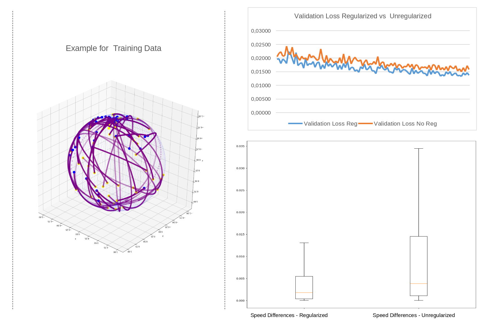
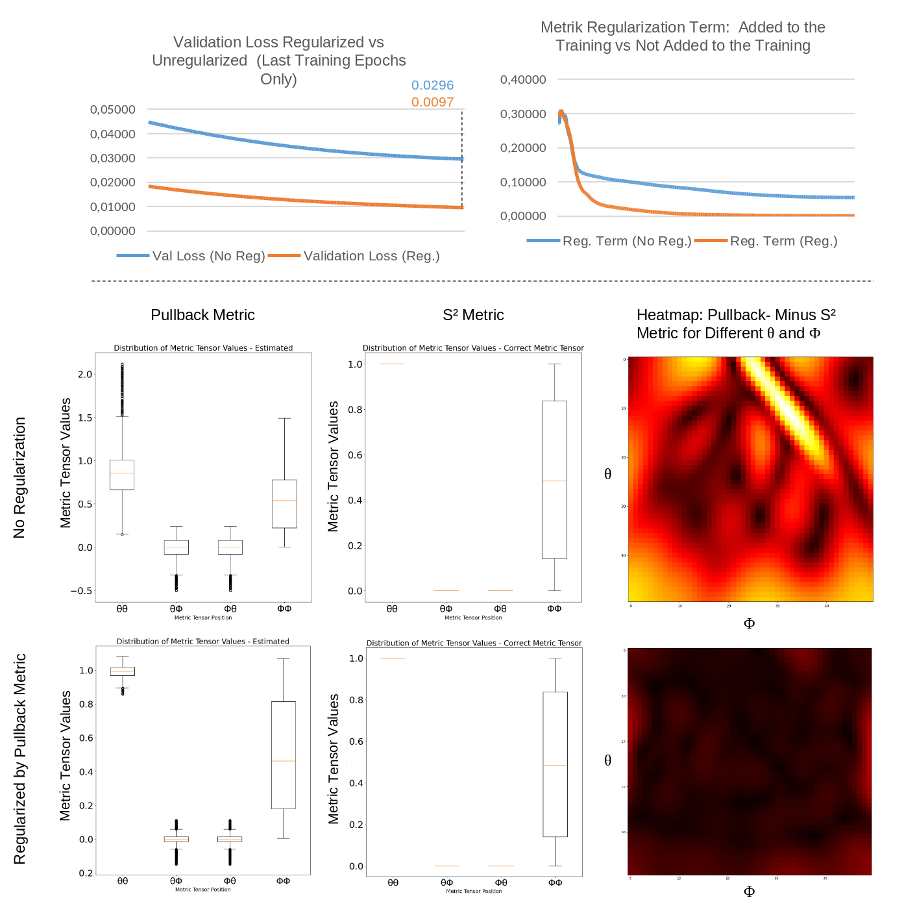

# Ideas for Geometrically Enriched Deep Learning

## 1. Two Concepts for Geometric Regularization

The idea of regularizing neuronal networks with concepts from differential geometry targets the aspect that deep learning models often operate on high dimensional non-euclidean manifolds. Distinct regularizion functions should improve the learning process by enforcing distinct pattterns from differential geometry. 

### 2.1. Speed Regularization for Learning Geodesics Parametrized By Radians (geodesic_sphere_nn.py)
One concept of regularizing models, learning geodesics on mannifolds, is to enforce parametrization by radians while regularizing for constant speed. 
$$|| \dot{γ}(t)|| = constant$$

### 2.2. Pullback Metric Regularization (s2_encoder.py)
The second concept for regularing a toy neural network is based on an encoder-like network, that transforms spherical polar coordinates to Cartesian coordinates in 3D. The regularization evalutes the pullback metric of the network against the $S^2$-metric tensor.

$
\begin{align}
\partial_\phi f = \frac{f(\theta,\phi) - f(\theta, \phi + \delta)}{\delta }\\
\partial_\theta f = \frac{f(\theta,\phi) - f(\theta + \delta, \phi)}{\delta}
\end{align}
$
$
\begin{equation}
g_{pullback} =
\begin{pmatrix}
\langle \partial_{\theta}f, \partial_{\theta}f \rangle & \langle \partial_{\theta}f, \partial_{\phi}f \rangle \\
\langle \partial_{\phi}f, \partial_{\theta}f \rangle & \langle \partial_{\phi}f, \partial_{\phi}f \rangle
\end{pmatrix}
\end{equation}
$

The pullback metric can then compared against the $S^2$ metric tensor:
$
\begin{equation}
g_{S^2} =
\begin{pmatrix}
R^2 & 0 \\
0 & R^2 sin^2\theta
\end{pmatrix}
\end{equation}
$

## Ideas for Extension of the Discrete Flow Matching Model of B. Boll et. al. (hd_flow_matching.py)
A model that encompasses a lot concepts from differential/information geometry is the flow matching model from the paper "https://arxiv.org/pdf/2402.07846" of B. Boll et. al. It reduces the model training to learning a distance in tangent space between randomly sampled start distributions and data samples pulled to the manifold on factorizing discrete distributions.The geometrical aspects are handled completely in pre and postprocessing steps. 

Possible research questions:
- How can it be extended to scenarios with interdepence between single probability variables
- How and to which degree can geometrical aspects be pulled into to training for non-determined situations?
- How can the model me conditioned?

<figure>
    
    <figcaption>Animation of multiple random samples, flowing from start to target based on the minimal example from the paper. </figcaption>
</figure>

